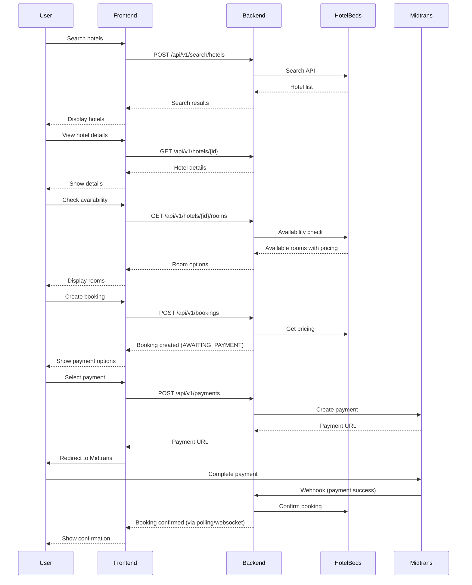

# Frontend Integration Guide

## Quick Start

### Prerequisites
- Node.js 18+ installed
- npm or yarn package manager
- Backend API running (default: `http://localhost:8080`)

### Setup Steps

1. **Clone Frontend Repository**
   ```bash
   git clone https://github.com/ekonugroho98/fe-bookingkuy.git
   cd fe-bookingkuy
   npm install
   ```

2. **Configure Environment Variables**

   Create `.env` file in frontend root:
   ```env
   VITE_API_BASE_URL=http://localhost:8080
   VITE_APP_NAME=Bookingkuy
   ```

3. **Start Development Server**
   ```bash
   npm run dev
   # Frontend will be available at http://localhost:3000
   ```

---

## Authentication Flow

### 1. User Registration

**Endpoint:** `POST /api/v1/auth/register`

```typescript
// frontend/src/services/auth.ts
interface RegisterData {
  name: string;
  email: string;
  password: string;
  phone: string;
}

async function register(data: RegisterData) {
  const response = await fetch(`${API_BASE_URL}/api/v1/auth/register`, {
    method: 'POST',
    headers: { 'Content-Type': 'application/json' },
    body: JSON.stringify(data),
  });

  if (!response.ok) {
    const error = await response.json();
    throw new Error(error.error);
  }

  return response.json();
}
```

### 2. User Login

**Endpoint:** `POST /api/v1/auth/login`

```typescript
interface LoginData {
  email: string;
  password: string;
}

interface LoginResponse {
  token: string;
  user: {
    id: string;
    name: string;
    email: string;
  };
}

async function login(data: LoginData): Promise<LoginResponse> {
  const response = await fetch(`${API_BASE_URL}/api/v1/auth/login`, {
    method: 'POST',
    headers: { 'Content-Type': 'application/json' },
    body: JSON.stringify(data),
  });

  if (!response.ok) {
    throw new Error('Invalid credentials');
  }

  const result = await response.json();

  // Store token in localStorage
  localStorage.setItem('token', result.token);
  localStorage.setItem('user', JSON.stringify(result.user));

  return result;
}
```

### 3. Using Authenticated Requests

Create an API client helper:

```typescript
// frontend/src/lib/api.ts
const API_BASE_URL = import.meta.env.VITE_API_BASE_URL;

async function apiRequest(
  endpoint: string,
  options: RequestInit = {}
): Promise<Response> {
  const token = localStorage.getItem('token');

  const headers: HeadersInit = {
    'Content-Type': 'application/json',
    ...options.headers,
  };

  if (token) {
    headers['Authorization'] = `Bearer ${token}`;
  }

  return fetch(`${API_BASE_URL}${endpoint}`, {
    ...options,
    headers,
  });
}

// Example: Get user profile
async function getProfile() {
  const response = await apiRequest('/api/v1/users/me');

  if (response.status === 401) {
    // Token expired or invalid
    localStorage.removeItem('token');
    window.location.href = '/login';
    throw new Error('Unauthorized');
  }

  return response.json();
}
```

### 4. Protecting Routes

```typescript
// frontend/src/components/ProtectedRoute.tsx
import { useEffect } from 'react';

export function ProtectedRoute({ children }: { children: React.ReactNode }) {
  const token = localStorage.getItem('token');
  const navigate = useNavigate();

  useEffect(() => {
    if (!token) {
      navigate('/login');
    }
  }, [token, navigate]);

  if (!token) {
    return null; // or loading spinner
  }

  return <>{children}</>;
}
```

---

## Booking Flow

### Complete Booking Journey



### Implementation Example

```typescript
// frontend/src/services/booking.ts

interface BookingRequest {
  hotel_id: string;
  room_id: string;
  check_in: string;  // ISO date string
  check_out: string; // ISO date string
  guests: number;
  payment_type: 'PAY_NOW' | 'PAY_AT_HOTEL';
}

// Step 1: Create Booking
async function createBooking(bookingData: BookingRequest) {
  const response = await apiRequest('/api/v1/bookings', {
    method: 'POST',
    body: JSON.stringify(bookingData),
  });

  if (!response.ok) {
    throw new Error('Failed to create booking');
  }

  return response.json();
}

// Step 2: Create Payment
async function createPayment(bookingId: string, paymentMethod: string) {
  const response = await apiRequest('/api/v1/payments', {
    method: 'POST',
    body: JSON.stringify({
      booking_id: bookingId,
      payment_method_type: paymentMethod,
    }),
  });

  if (!response.ok) {
    throw new Error('Failed to create payment');
  }

  const result = await response.json();

  // Step 3: Redirect to Midtrans
  window.location.href = result.payment_url;
}
```

---

## Common Integration Patterns

### 1. Searching Hotels

```typescript
// frontend/src/services/hotel.ts
interface SearchParams {
  checkIn: Date;
  checkOut: Date;
  city: string;
  guests: number;
  page?: number;
  perPage?: number;
}

async function searchHotels(params: SearchParams) {
  const queryParams = new URLSearchParams({
    page: String(params.page || 1),
    per_page: String(params.perPage || 20),
  });

  const response = await apiRequest(
    `/api/v1/search/hotels?${queryParams}`,
    {
      method: 'POST',
      body: JSON.stringify({
        check_in: params.checkIn.toISOString(),
        check_out: params.checkOut.toISOString(),
        city: params.city,
        guests: params.guests,
      }),
    }
  );

  return response.json();
}
```

### 2. Getting Hotel Details

```typescript
async function getHotelDetails(hotelId: string) {
  const response = await apiRequest(`/api/v1/hotels/${hotelId}`);

  if (response.status === 404) {
    throw new Error('Hotel not found');
  }

  return response.json();
}
```

### 3. Checking Room Availability

```typescript
interface AvailabilityParams {
  hotelId: string;
  checkIn: string; // YYYY-MM-DD format
  checkOut: string; // YYYY-MM-DD format
  guests: number;
}

async function checkAvailability(params: AvailabilityParams) {
  const queryParams = new URLSearchParams({
    checkIn: params.checkIn,
    checkOut: params.checkOut,
    guests: String(params.guests),
  });

  const response = await apiRequest(
    `/api/v1/hotels/${params.hotelId}/rooms?${queryParams}`
  );

  return response.json();
}
```

### 4. Getting User Bookings

```typescript
async function getMyBookings(page = 1, perPage = 20) {
  const response = await apiRequest(
    `/api/v1/bookings/my?page=${page}&per_page=${perPage}`
  );

  return response.json();
}
```

---

## Error Handling

### Centralized Error Handler

```typescript
// frontend/src/lib/apiErrorHandler.ts
import { toast } from 'react-toastify';

export function handleApiError(error: unknown): void {
  if (error instanceof Error) {
    switch (true) {
      case error.message.includes('not found'):
        toast.error('Resource not found');
        break;
      case error.message.includes('Unauthorized'):
      case error.message.includes('Invalid'):
        toast.error('Authentication failed. Please login again.');
        localStorage.removeItem('token');
        window.location.href = '/login';
        break;
      case error.message.includes('already registered'):
        toast.error('Email already registered');
        break;
      default:
        toast.error('Something went wrong. Please try again.');
    }
  } else {
    toast.error('Unexpected error occurred');
  }
}

// Usage
try {
  await createBooking(bookingData);
  toast.success('Booking created successfully!');
} catch (error) {
  handleApiError(error);
}
```

---

## Common Issues and Solutions

### Issue 1: CORS Error

**Symptom:** Browser shows CORS policy error

**Solution:** Ensure frontend URL is in backend's allowed origins

```bash
# Backend .env file
CORS_ALLOWED_ORIGINS=http://localhost:3000,http://localhost:8081
```

### Issue 2: 401 Unauthorized

**Symptom:** All authenticated requests return 401

**Solutions:**
1. Check token exists in localStorage
2. Verify token format: `Authorization: Bearer <token>`
3. Check token hasn't expired (default: 24 hours)
4. Ensure JWT_SECRET matches between services

### Issue 3: 404 Not Found

**Symptom:** Endpoint returns 404

**Solutions:**
1. Verify API base URL is correct
2. Check endpoint path matches documentation
3. Ensure IDs are valid (hotel_id, booking_id, etc.)

### Issue 4: Booking Creation Fails

**Symptom:** Booking creation returns 400 error

**Common causes:**
1. Check-out date is before check-in date
2. Check-in date is in the past
3. Room not available for selected dates
4. Invalid hotel_id or room_id

**Debug:** Check error message in response:
```typescript
const response = await apiRequest('/api/v1/bookings', { ... });
const error = await response.json();
console.error(error.error); // Specific error message
```

### Issue 5: Payment Webhook Not Working

**Symptom:** Payment successful but booking status not updated

**Solutions:**
1. Check Midtrans webhook URL is set correctly
2. Ensure backend server is publicly accessible (Midtrans needs to reach it)
3. Use ngrok for local development:
   ```bash
   ngrok http 8080
   # Update Midtrans webhook URL to ngrok URL
   ```

---

## Testing Checklist

Before deploying to production, test these scenarios:

- [ ] User can register new account
- [ ] User can login with valid credentials
- [ ] User cannot login with invalid credentials
- [ ] User can search for hotels
- [ ] User can view hotel details
- [ ] User can check room availability
- [ ] User can create a booking
- [ ] User can see their bookings
- [ ] User can cancel a booking
- [ ] User can update their profile
- [ ] Protected endpoints return 401 without token
- [ ] Expired token returns 401
- [ ] Invalid data returns 400 with error message
- [ ] Payment flow completes successfully
- [ ] Webhook updates booking status

---

## Best Practices

### 1. Token Management

```typescript
// Store token securely
const token = localStorage.getItem('token');

// Check if token exists before protected requests
if (!token) {
  navigate('/login');
  return;
}

// Clear token on logout
function logout() {
  localStorage.removeItem('token');
  localStorage.removeItem('user');
  navigate('/login');
}
```

### 2. Loading States

```typescript
const [loading, setLoading] = useState(false);
const [error, setError] = useState<string | null>(null);

async function loadHotels() {
  setLoading(true);
  setError(null);

  try {
    const data = await searchHotels(params);
    setHotels(data.hotels);
  } catch (err) {
    setError('Failed to load hotels');
  } finally {
    setLoading(false);
  }
}
```

### 3. Pagination

```typescript
async function loadPage(page: number) {
  const response = await apiRequest(
    `/api/v1/bookings/my?page=${page}&per_page=20`
  );
  const data = await response.json();

  setBookings(data.bookings);
  setCurrentPage(data.page);
  setTotalPages(Math.ceil(data.total / data.per_page));
}
```

### 4. Date Formatting

```typescript
// Backend expects ISO 8601 format
function formatDateForAPI(date: Date): string {
  return date.toISOString();
}

// Availability endpoint expects YYYY-MM-DD format
function formatDateForAvailability(date: Date): string {
  return date.toISOString().split('T')[0]; // "2025-01-15"
}

// Display date to user
function formatDisplayDate(isoString: string): string {
  return new Date(isoString).toLocaleDateString('en-US', {
    year: 'numeric',
    month: 'long',
    day: 'numeric',
  });
}
```

---

## Postman Collection

For API testing without frontend, use the Postman collection:

```bash
# Import this file into Postman
docs/postman-collection.json
```

Or manually import endpoints from API documentation.

---

## Next Steps

1. **Set up local development environment**
2. **Test authentication flow**
3. **Implement hotel search**
4. **Build booking flow**
5. **Add payment integration**
6. **Test error scenarios**
7. **Deploy and test in staging**

---

## Support

For questions or issues:
- Backend API docs: `docs/API.md`
- Backend repository: https://github.com/ekonugroho98/be-bookingkuy
- Create issue in GitHub with detailed description

---

**Last Updated:** 2025-12-27
